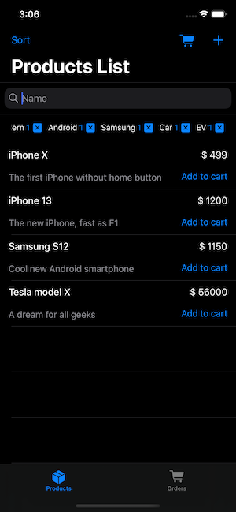
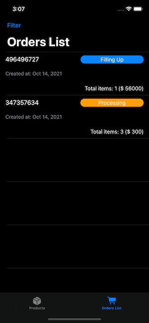

# Overview

A simple order manager, created in order to get acquainted with the features and limitations of the local Realm database. The project is written in Swift 5 using UIKit. App architecture pattern is MVP + Coordinator. The Realm-related code and its objects are isolated with the database layer in order to isolate the database layer and provide the ability to support different database engines.

# How it works
Each launch the app creates an empty order with the status "Filling up". A user is allowed to create an unlimited number of products and add them to the cart. Once an order is processed from the Basket screen its status gets changed to "Processing" and new empty order is created for the next interactions.

## Contents

The app have following screens:
- **Product list screen** -- A screen allowing a user to see all products and existing tags, sort them by several parameters, and delete them.
- **Product add/modify screen** -- A screen allowing a user to create a new product or modify an existing product; also provide a way to manage tags.
- **Basket screen** -- A screen providing ability to see the current order and remove products from it. It also allows a user to finish the order.
- **Orders list screen** -- A screen allowing a user to see all the existing orders, filter them by several parameters, and delete them.

## TODO:
- Provide sync methods for all CRUD operations
- Convenient method to alter DTOs
- Generate DTOs with a codegen tool (?)
- Live wrappers for DTOs